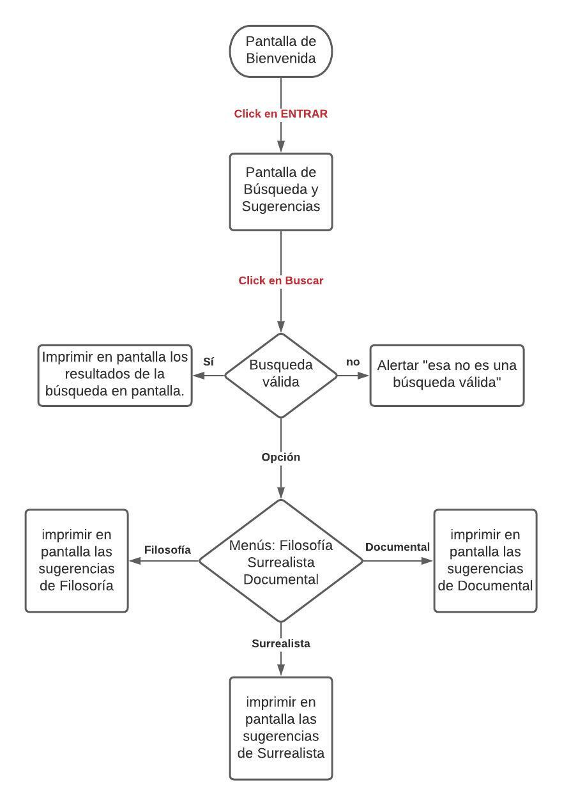
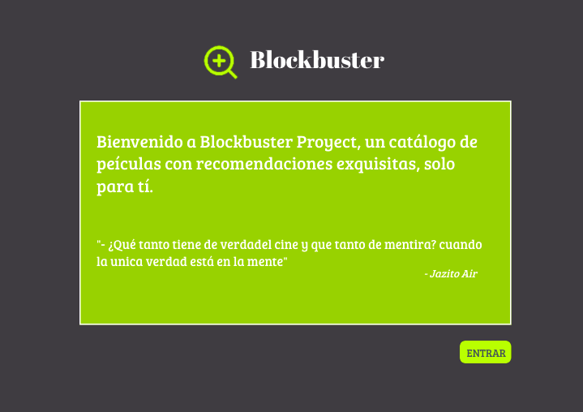
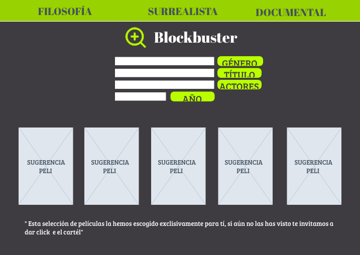
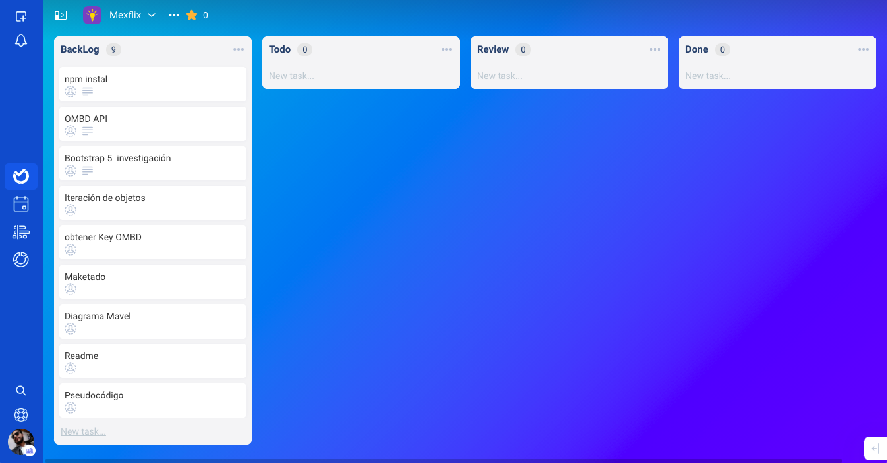
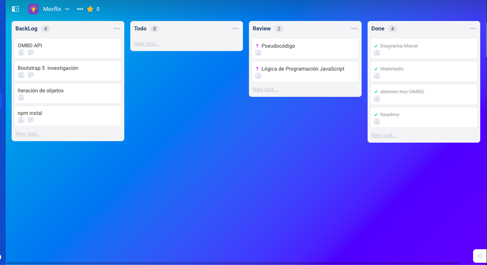

# Deep Moves Proyect

---
Índice

    1. Descripción 
    2. Necesidades del Cliente
    3. App Catálogo de Películas 
    4. Diagrama de Flujo
    5. Maquetado
    6. Backlog
    7. Pseudocódigo
    
---
## 1. Descripción 

Se nececita una aplicación que muestre al usuario una lista de películas sugeridas para un público esecífico, iteresado en el tema, de las películas filosóficas, surrealistas o el cine documental.

---
## 2. Tipo de Cliente 

Cliente:
Jóvenes y adultos con gusto por el arte, el surrealismo, la filosofía y la concientización humana. 

Necesidades:
Elusuario busca recomendaciones según el tema de su interés, filosofía, surrealismo y documental.

---
## 3. Aplicación Catálogo de Películas

Aplicación diseñada para dispositivos móviles y de escritorio, diseñada para mostrar un catálogo de películas, con tres temas principales, la filosofía, el surrealismo y el cine documental, éstas tiene en común el despertar de la conciencia individual y colectiva, el usuario también podrá buscar una película por título, por año y por actores. Cada busqueda contiene 5 especificaciones, Título, Año de estreno, Reparto, Cartel y Género. 

---
## 4. Diagrama de Flujo

---
## 5. Maquetado
  
---
## 6. Backlog
  

---
## 7. Pseudocódigo
---
# ReadMe

---

> This Readme should be replaced with the project documentation following the SDLC procedures for Agile Software Development Lyfe Cycle.
